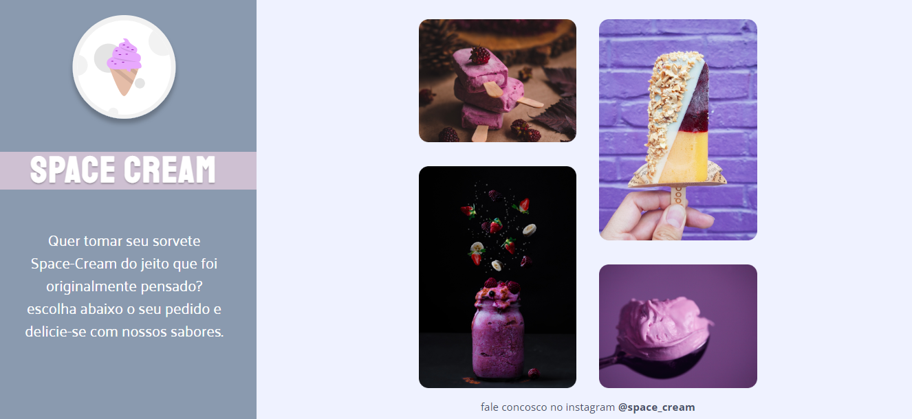

<h1 align="center"> Space Cream versão web</h1>

Página feita com intuito de treinar alguns conhecimentos entre HTML, CSS E JAVASCRIPT e conceitos como mobile first, transições e transformações e animação em CSS 

  <a href="#-tecnologias">Tecnologias</a>&nbsp;&nbsp;&nbsp;|&nbsp;&nbsp;&nbsp;
  <a href="#-projeto">Projeto</a>&nbsp;&nbsp;&nbsp;|&nbsp;&nbsp;&nbsp;
  <a href="#-layout">Layout</a>&nbsp;&nbsp;&nbsp;|&nbsp;&nbsp;&nbsp;
  <a href="#memo-licença">Licença</a>

 

  

## 🚀 Tecnologias

Esse projeto foi desenvolvido com as seguintes tecnologias:

- HTML e CSS
- Git e Github
- Figma

## 💻 Projeto

O App controle de hábitos é um aplicativos para usar no controle dos seus hábitos diários para adquirir mais qualidade de vida.

- [Visite o projeto online](https://ramirisonoliveira.github.io/projeto_space_cream/)

## 🔖 Layout

Você pode visualizar o layout do projeto através [DESSE LINK](https://www.figma.com/file/HHxdEveoB6OiEpWiXGBz5E/Stage-03---Grid-com-anima%C3%A7%C3%B5es-(Copy)?node-id=0%3A3&t=A584xieXpTWwhQCL-0). É necessário ter conta no [Figma](https://figma.com) para acessá-lo.

## :memo: Licença

Esse projeto está sob a licença ROL.

---

Feito by Ramirison Oliveira(https://github.com/RamirisonOliveira)